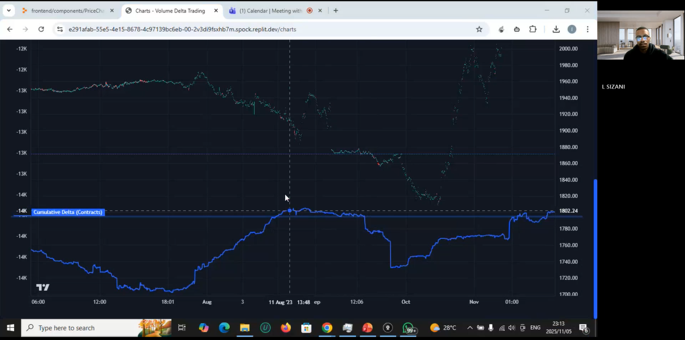

# Volume Cumulative Delta Backtest in Forex

A comprehensive backtesting engine for analyzing the impact of futures volume and cumulative delta on forex market price movements.

### 📹 Watch Demo

[](https://drive.google.com/file/d/1stowQMaHMYb4ZnHsv6Nl0utJcr7OK3ya/view?usp=drive_link)

*Click the image above to watch the full demonstration video*

## Overview

This project provides a backtesting framework for testing trading strategies based on volume analysis and cumulative delta indicators. It helps traders understand how futures volume influences market price movements in the forex market.

## Features

- **Real-time Market Data Integration**: Connect to live market data feeds
- **Cumulative Delta Analysis**: Track and visualize cumulative delta patterns
- **Interactive Charts**:
  - Price charts with candlestick visualization
  - Delta charts with volume analysis
  - Responsive chart design
- **Backtesting Engine**: Test trading strategies against historical data
- **Modern Web Interface**: Built with Next.js for a smooth user experience

## Project Structure

```
.
├── backend/              # Backend services and data processing
├── frontend/             # Next.js frontend application
│   ├── components/       # React components
│   ├── pages/           # Next.js pages and API routes
│   └── styles/          # CSS styling
└── attached_assets/     # Project assets and screenshots
```

## Prerequisites

- Node.js (v14 or higher)
- npm or yarn
- Python 3.x (for backend services)

## Installation

1. Clone the repository:
```bash
git clone https://github.com/lwandilesizani/Volume-Cummulative-Delta-Backtest-in-Forex.git
cd Volume-Cummulative-Delta-Backtest-in-Forex
```

2. Install frontend dependencies:
```bash
cd frontend
npm install
```

3. Install backend dependencies:
```bash
cd backend
pip install -r requirements.txt
```

## Usage

### Running the Frontend

```bash
cd frontend
npm run dev
```

The application will be available at `http://localhost:5000`

### Running the Backend

```bash
cd backend
python main.py
```

## Features in Detail

### Backtesting
Access the backtesting interface to:
- Load historical market data
- Configure trading parameters
- Run backtests with cumulative delta strategies
- Analyze performance metrics

### Charts
Interactive charting features:
- Real-time price updates
- Volume delta visualization
- Customizable timeframes
- Technical indicators overlay

## Contributing

Contributions are welcome! Please feel free to submit a Pull Request.

## License

This project is open source and available under the MIT License.

## Contact

For questions or support, please contact: Lwandilesizani102@gmail.com
